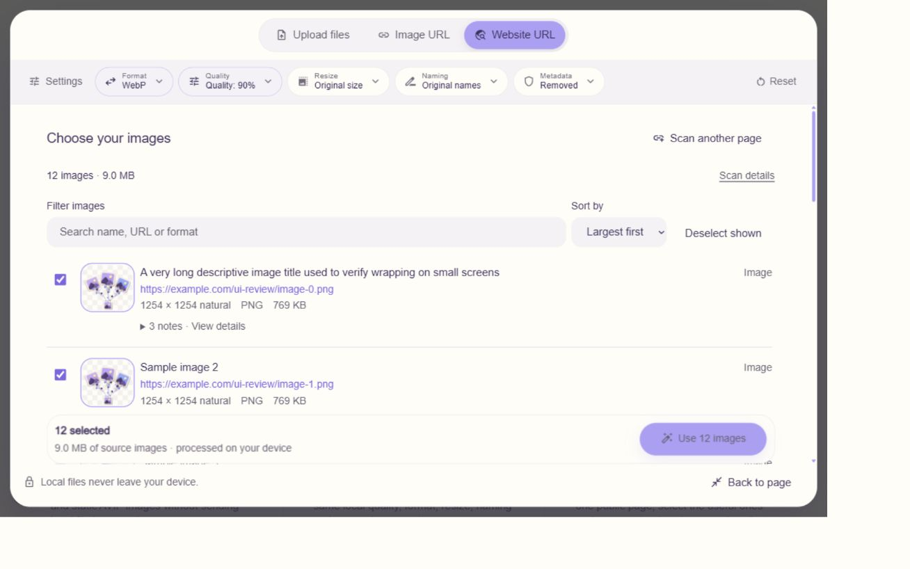
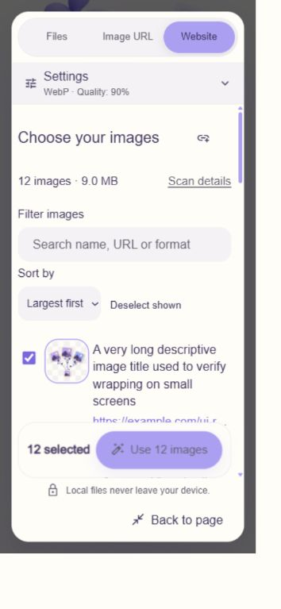

# UI and UX refinement — September 29, 2026

## Scope and design

Reviewed the three input modes, shared settings and compression workspace, all published tool routes, blog index and three articles, and About, Privacy, Terms and Cookies. Kept the existing Inter typography, violet/lavender identity, rounded components, media and page structure.

## Implemented findings

| Finding | Change |
| --- | --- |
| Website scanning required competing page and result-list scrolling | URL submissions promote the existing tool to a native modal workspace that fits the viewport. The document is locked and only the workspace content scrolls. Back to page and Escape restore normal page navigation. The same DOM tree retains files and worker results. |
| Large summary blocks obscured the images | Results lead with the image count and total bytes; additional scan statistics are in a native disclosure. The URL form collapses after success and is available through Scan another page. |
| Discovery and optimization were stacked vertically | Separate review and optimization views within the same workspace; returning to review retains the prepared batch until selection changes. |
| Image rows were difficult to scan | Smaller thumbnails, plain divided rows, expandable issue details, name/URL/format filtering, largest-first/page-order sorting, select/deselect shown, selected byte total and a persistent continuation action. |
| Mobile settings consumed the first screen | Collapsed settings summary with a two-column disclosure. Source modes appear before settings. |
| Mobile source modes unexpectedly stacked vertically | Scoped a global showcase-only segmented-control rule to `.ui-showcase`. |
| Hidden modes could consume pasted images | Paste handlers ignore file-intake regions inside hidden panels. |
| URL requests could remain pending indefinitely | Added a 30-second client request deadline and cancellation propagation; cancellation controls for image imports and scans, abort-on-unmount cleanup, and image-URL offline guidance. |
| Keyboard navigation and text contrast gaps | Added skip links and focusable main landmarks, current-page navigation, keyboard-focusable comparison tables, stronger muted text/focus tokens, settings focus restoration on Escape, and reduced-motion page scrolling. |
| Long guides had no section navigation | Added an In this guide disclosure with working section links; article titles on the blog index are now links and repeated reading links have distinct accessible names. |
| Repeated table values generated duplicate React keys | Article comparison cells use their column position as the key, allowing repeated values such as Yes without reconciliation warnings. |
| Duplicate `privacy` anchor on the homepage | Removed the tool footer's duplicate ID; the page's Privacy section retains the anchor. |

## Verification evidence

- TypeScript: `npm run typecheck` passed.
- Application lint: `npx --no-install eslint src` passed without warnings.
- Repository lint passed with 94 existing warnings in bundled skill scripts, not application source.
- Changed source files formatted with Prettier; `git diff --check` passed.
- Browser: Codex in-app Chromium, desktop and mobile viewport overrides. These are emulated viewport checks, not physical touch-device tests.
- [Mobile route checks](mobile-route-checks.json) and [desktop route checks](desktop-route-checks.json): 27 routes covering every published non-home tool page and every supporting public page. No horizontal page overflow; a main-content target exists on every page. Home was checked separately during all three mode flows.
- Focused workspace: measured top/bottom within the viewport, document overflow hidden, workspace overflow auto and image-list overflow visible. Mobile workspace `scrollWidth` equaled `clientWidth`.
- Verified filtering with no matches, bulk deselection disabling continuation, individual selection, handoff to the local worker, and preservation of completed results when returning to review.
- Local PNG test image: 769 KB to 129 KB WebP, 83.3% reduction. Both file chooser import and clipboard paste were exercised. Comparison slider keyboard input changed its announced value from 50% to 51%.
- Image URL success and a twelve-image webpage result were exercised using temporary fixtures backed by repository media. The scanner generated a ready replacement ZIP link. The browser's download event timed out, so saving the ZIP to disk was not verified.
- Verified settings Escape restores focus without closing the focused workspace; a subsequent Escape closes the workspace and restores document scrolling. Closing/reopening the workspace retained scanner results.
- Article section links were checked against actual target IDs.

## Limits and follow-up checks

- Live outbound fetches failed in this execution environment. A direct Node fetch to `https://example.com` returned `EACCES`, independently of application code. Real external scan success requires verification in an environment with outbound access. Error recovery was checked with the shipped fetch path.
- Temporary fixture branches were removed from both scanner API and image fetch helper. No fixture code or relaxed network-validation path remains under `src`.
- Cancellation controls and abort propagation were inspected; this environment's immediate network denial prevented a sustained live-request cancellation test.
- No production build, new test framework, unit/e2e suite, or deployment was performed. No claim of complete WCAG conformance or physical-device coverage is made.

## Screenshots

The scanner screenshots use explicitly synthetic test image names and repository imagery, not the contents of an external website.

## Research used

- [W3C: Understanding Reflow](https://www.w3.org/WAI/WCAG21/Understanding/reflow): preserve access at narrow widths and avoid content that needs two-dimensional scrolling.
- [W3C: Scrollable content and sequential focus navigation](https://www.w3.org/WAI/standards-guidelines/act/rules/0ssw9k): make scrollable regions operable using a keyboard.
- [Playwright: Accessibility testing](https://playwright.dev/docs/accessibility-testing): automated checks supplement, rather than replace, interaction and manual accessibility review.
- [Playwright: Visual comparisons](https://playwright.dev/docs/test-snapshots): use deterministic content and consistent rendering environments for future screenshot regression baselines. The screenshots here are manual verification artifacts, not an automated baseline suite.
